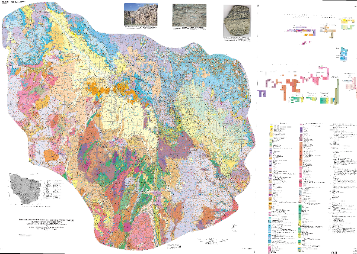
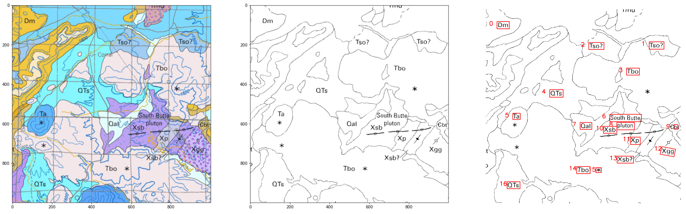
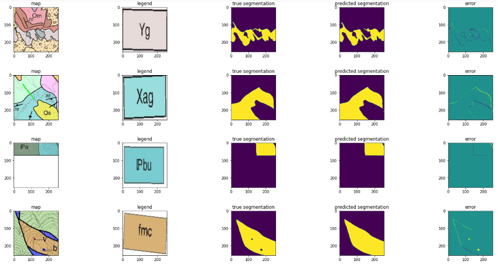

# DARPA_Map_Feature_Extraction
This is the repo for DARPA AI competition of map feature extraction

## Background

A variety of raw, non-fuel materials known as “critical minerals” to manufacture products that are essential to national security;
United States Geological Survey (USGS) assesses all critical mineral resources in the U.S.  and help identify opportunities for economically and environmentally viable resource development.
The Defense Advanced Research Projects Agency (DARPA) and USGS have partnered to explore the potential for artificial intelligence (AI) tools to accelerate critical mineral assessments.

The following is an example of how a map looks like:

The objective of this project is that given the above map image, build a model that can automatically segment different (polygon, line, points) given the legend in the side of the map. 

## Data Exploration 

The data contains 169 mineral fields for training; (with label) 82 mineral fields for testing (no label); Each mineral field contains:One map image (super resolution); One JSON file describing the map and legend; Corresponding raster files for each legend as segmentation. Three key features – polygon, line, and point. 3130 polygons, 187 lines, 338 points legends overall in the training maps. Every map has its own way of legend naming, no consistent pattern.  

## Data Preprocessing

For each map image, the resolution is about in the magnitudee of 10,000 * 10,000, which are way too big for image models. The first thing is to patchify these big map images to small (256*256) patch images. This is done in create_patch_imgs.py.

Before the patchifying, we applied the histogram equalization to increases the global contrast of images with colors that are represented by a similar range of intensity values. Intensities can be better distributed on the histogram utilizing the full range of intensities evenly. Adaptive Histogram Equalization differs from ordinary histogram equalization in the respect that the adaptive method computes several histograms, each corresponding to a distinct section of the image, and uses them to redistribute the lightness values of the image. It is therefore suitable for improving the local contrast and enhancing the definitions of edges in each region of an image. This preprocessing is observed in our experiment to increase F1-score performance by aournd 0.03.

Another thing we tried is the Optical Character Recognition (OCR). The OCR is helpful if somehow 1) the legend coordinate in json file is missing, 2) the legend in the map is not high quality or there is a color mismatch between legend/map. By OCR, we can quickly track in which area the text in the legend shows up in the map. This is a key step in boost our overall polygon F1-score. 

## Model Training

After the map image and segmentation label is patchified to (256X256) images, the legend image is also cutted from the map image given the coordinates in the json file and resize to 256X256, then we build a model that can use the map patch image & legend image as input, the segmentation label as output. We use a similar model architecture in a reference cited here (A Variational U-Net for Conditional Appearance and Shape Generation). 

## Model Inference 
The model inference is conducted with patch image and then re-stitch them back into a whole image. Here we randomly plot some examples of how the patches perform. From these plot we can see the model is really capable, each small regions with complex geometries can be well captured. 

The model is doing less satisfying for points & line features. One reason we believe is the data imbalance in points & lines. For example, the points has 256X256=65536 pixels for each image, but only one a several pixels are 1's, while other pixels are all zeros. This can be extremely challenge to segment. One thing we can try in the future is to use smaller patches (like 64X64 or 32X32) instead of 256X256. Another thing to try is some attention-based model. Given more time, we'll spend more efforts on points and lines. Especially for points, one member in our team is exploring YOLO with synthetic data, this can potentially extract points feature very accurately.  

## Performance measure
The performance is evaluated by a customized F-1 score given in this competition. (see metrics.py) In general, our model performs relatively well on polygons, but less satisfying on points and lines. We also find the cases where polygon fails to predict when using this model 1) Closed-color legends that are non-differentiable, 2) 2) Mismatched map/legend color. In the future, to tackle these two drawbacks, we can apply our OCR algorithm and a discriminor to automatically detect "bad legend" and replace with the ones that cut directly from maps.  

